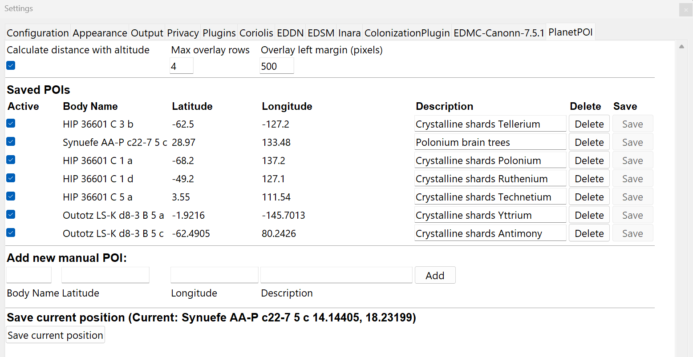
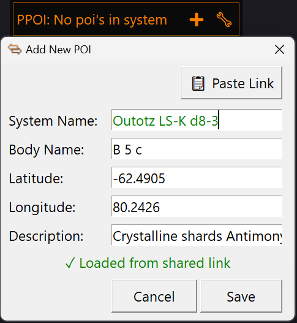
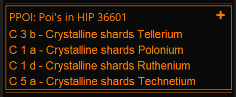
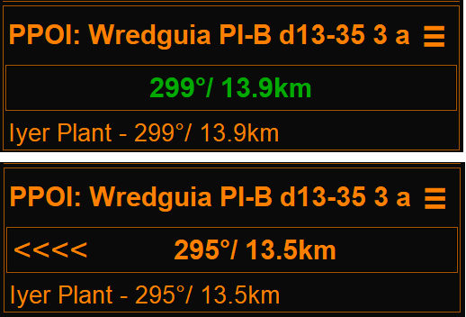
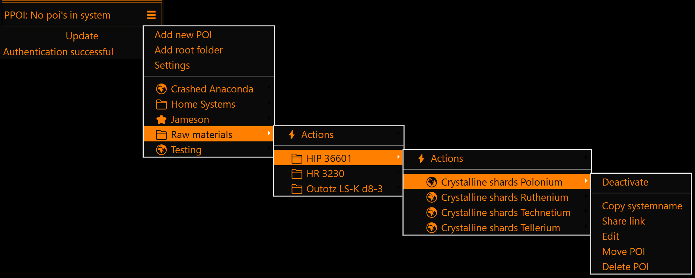
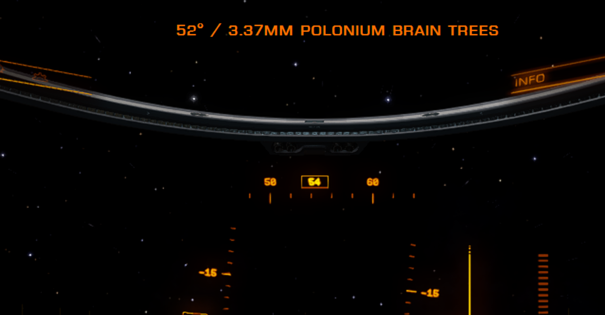

# EDMC Planet POI Plugin

Plugin for [EDMC](https://github.com/EDCD/EDMarketConnector) that helps you save and navigate to Points of Interest (POIs) on planetary surfaces in Elite Dangerous. Perfect for saving interesting locations while exploring, organizing your discoveries, and sharing coordinates with other commanders.

## Installation

1. Download the [latest release](https://github.com/bbbkada/EDMC-PlanetPOI/releases) zip file
2. Extract to your EDMC plugins folder:
   - Windows: `%LOCALAPPDATA%\EDMarketConnector\plugins\`
3. Restart EDMC
4. **(Optional but recommended)** Install [EDMCOverlay](https://github.com/inorton/EDMCOverlay) for in-game overlay functionality

## Requirements

- [Elite Dangerous Market Connector (EDMC)](https://github.com/EDCD/EDMarketConnector)
- [EDMCOverlay](https://github.com/inorton/EDMCOverlay) (optional, for in-game overlay)
- Elite Dangerous (Horizons/Odyssey for planetary landings)
- In-game overlay only works in windowed and borderless graphics mode, due to EDMCOverlay limitations

## Screenshots

### Configuration Settings
Adjust overlay position to center on your screen, maximum visible POIs, altitude calculation options and option the show directions in EDMC gui. Distances for graphical ingame guidance.
All POI's are here shown flat and sortable by system or description, export/import all POI's for backup/restore, sharing etc.

### Add/Edit POI Dialog
Add new POIs with system name autocomplete. Auto-fills current system, and position if in planetary orbit. Paste shared links with Ctrl+V or button.

### System View
When entering a system, all POIs for current system is displayed with bodyname. Right-click for options.

### Body View
On a planetary surface, see all POIs for current body. Use right-click to show/hide directions overlay (and or GUI) visibility, Added optional guidance direct into EDMC if you don't want in-game overlay:

### POI Menu
Access POI management options via the menu button (☰). Edit, move, delete, share POIs or create folders.
System POI's is represented by a Star and planetary POI's by a Globe. Folder are folders:

### In-Game Overlay
Real-time overlay showing bearing, distance, and description for active POIs (requires EDMCOverlay):

## Features list

### 📍 Save & Navigate POIs
- Save planetary coordinates with descriptions and notes
- Automatically captures your current position when on a surface
- Real-time in-game overlay showing bearing and distance to active POIs
- System name validation through Spansh API
- Proper Elite Dangerous body name formatting (e.g., "C 3 a b")

### 📁 Folder Organization
- Organize POIs into folders for better management
- Create nested folder structures
- Move POIs and folders between locations
- Collapsible folder view in the main UI

### 🔗 Share POIs
- Generate shareable Urls for any POI, Url points to a info page at github.io, if pasted in a browser
- Paste shared url in the add dialog to autofill it's values.
- Share individual POIs or entire collection via JSON export/import

### ⚙️ Customizable Settings
- Adjust maximum number of overlay rows displayed
- Configure overlay horizontal position
- Toggle altitude-based distance calculation
- Enable/disable individual POI overlays with checkboxes

### 📥 Import/Export
- Export all POIs to JSON file
- Import POIs from JSON file (merge or replace)
- Backup and share your entire POI collection

