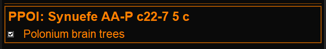

# EDMC Planet Poi Plugin

Plugin for [EDMC](https://github.com/EDCD/EDMarketConnector) that lets you save positions on planets/bodys and help you navigate to them.  
Useful when cruising around and suddenly want to save current position or find a location shared by someone else.

To get ingame overlay, you need [EDMCOverlay](https://github.com/inorton/EDMCOverlay) installed.  
  
in setting you can adjust max poi´s to show, if body has multiple saved. Adjust the overlay position, and choose if altitude is added to distance or not.
You can share poi with a link, to other commanders.   
  

You add new poi´s by pressing the + button in the gui, System name is verified against Spansh API.
Current position will be autofilled if in orbit of a body, otherwise only current system.
If you have a shared link in clipboard, you can paste a shared poi with ctrl+V or the button.

  

The EDMC gui will show bodynames that have poi´s and their description when entering a system.

As soon as the dashboard shows coordinates, the ui will switch to body mode and only show the poi´s for the body.  
You can use the gui checkboxes to enable/disable ingame overlay for individual Poi´s.   

## Installation

Download latest release zip-file and unpack to EDMC Plugin folder.
Remember to install [EDMCOverlay](https://github.com/inorton/EDMCOverlay) if you want in-game overlay.
