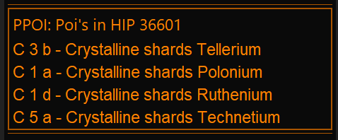

# EDMC Planet Poi Plugin

Plugin for [EDMC](https://github.com/EDCD/EDMarketConnector) that lets you save positions on planets/bodys and help you navigate to them.  

To get ingame overlay, you need [EDMCOverlay](https://github.com/inorton/EDMCOverlay) installed.  
  
in setting you can adjust max poi´s to show, if body has multiple saved. Adjust the overlay position, and choose if altitude is added to distance or not.
You can create poi´s manually by entering coords or if at the location, save current position.  
The body text is case sensitive and need to have the same format as reported by EDMC.  
  

You add new poi´s by pressing the + button in the gui, System name is verified against Spansh API.
Current position will be autofilled if in orbit of a body, otherwise only current system.

  

The EDMC gui will show bodynames that have poi´s and their description when entering a system.

As soon as the dashboard shows coordinates, the ui will switch to body mode and only show the poi´s for the body.  
You can use the gui checkboxes to enable/disable ingame overlay for individual Poi´s.   

